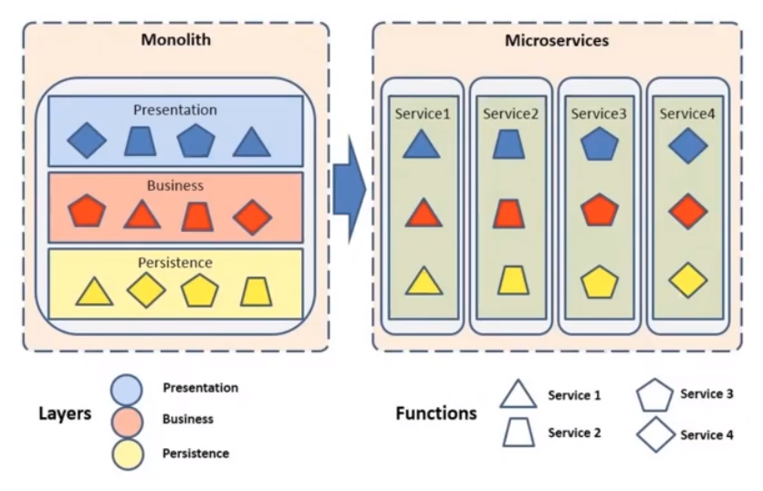
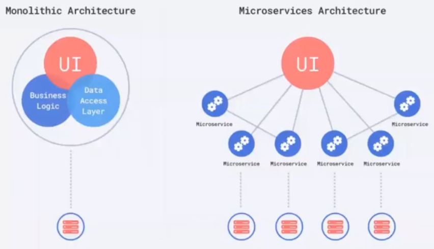
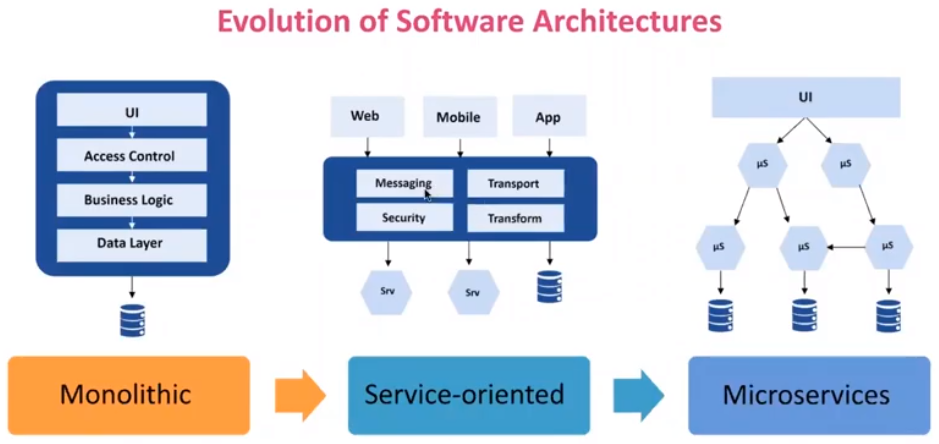
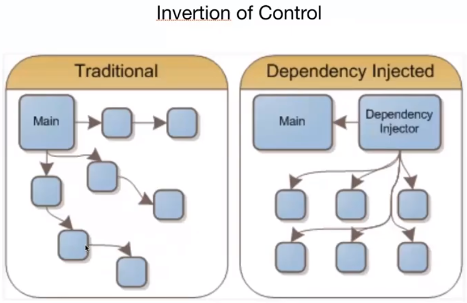

<h1 align="center">DIO - Construindo um ecossistema com arquitetura baseada em Microsserviços usando Spring Cloud</h1>

<h2>1 - Introdução à Arquiteturas de Software: do Monolito ao Microsserviço</h2>

 
  
   
  
   
  
   
  
   
  

<h2>2 - Conhecendo o Ecossistema Spring Boot e Criando um Microsserviço de Catálogo de Produtos</h2>
  
  * Spring foi criado para resolver um problema comum no desenvolvimento de software que é interdependência entre objetos;
  * O Spring faz a inversão de controle, ele pega para ele o controle sobre as intâncias de objeto do sistema;
  * 

   

 
  
   
  
   

<h2>3 - </h2>
<h2>4 - </h2>
<h2>5 - </h2>
<h2>6 - </h2>
<h2></h2>
<h2></h2>
<h2></h2>
<h2></h2>
<h2></h2>
